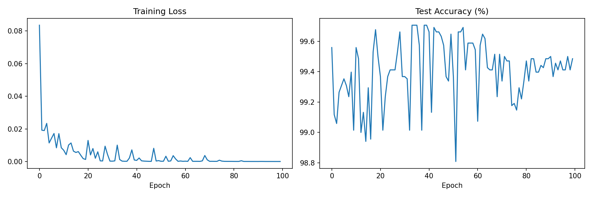

# 基于可穿戴惯性传感器的坐站转换相位识别

> **[English README](README.md)**

## 📚 文档
- [对比分析报告](docs/对比分析报告.md) — 论文与代码对比分析
- [复现方案](docs/复现方案.md) — 论文复现详细步骤
- [实验设备介绍与操作指南](docs/实验设备介绍与操作指南.md) — 设备说明与实验How-to
- [AI训练说明��操作指南](docs/AI训练说明与操作指南.md) — AI模型训练完整教程
- [数据格式说明](docs/数据格式说明.md) — 原始数据与数据集格式详解

---

本仓库为以下论文的核心代码：
**标题**：A Novel CNN-BiLSTM ensemble model with attention mechanism for sit-to-stand phase identification using wearable inertial sensors（一种基于注意力机制的新型CNN-BiLSTM集成模型用于可穿戴惯性传感器的坐站转换相位识别）
**作者**：Xin Chen, Shibo Cai*，Longjie Yu, Xiaoling Li, Bingfei Fan, Mingyu Du, Tao Liu, and Guanjun Bao

## 实验设备
实验中使用了以下设备（详见论文第二节"实验验证"部分）：
- 两块 AMTI 力板
- 一套 Optima 信号放大器
- 两个无线惯性传感器
- 一个 Awinda Station 接收器

## 计算环境
- 操作系统：Microsoft Windows 10
- CPU：Intel Core i7-13700K
- 内存：32 GB RAM
- GPU：NVIDIA GeForce RTX 3090

## 软件和库
- IMU 数据处理、相位分割和构建 STS-PD 数据集（具体运行代码见 "IMU dataprocessing" 和 "phase segmentaion and build dataset" 文件夹）：MATLAB
- 机器学习和神经网络算法开发环境：PyCharm
- Python：3.7
- CUDA：11.7
- Keras：2.10
- NumPy：1.21.5
- Scikit-Learn：1.0.2

## 坐站转换相位
坐站转换过程被划分为五个相位：
1. **初始坐姿相位**（Initial Sitting Phase）
2. **屈曲动量相位**（Flexion Momentum Phase）
3. **动量转移相位**（Momentum Transfer Phase）
4. **伸展相位**（Extension Phase）
5. **稳定站立相位**（Stable Standing Phase）

## 相位识别算法
为了准确识别转换相位，采用了以下方法：
1. **阈值法** — 用于识别初始坐姿和稳定站立两个静态相位
2. **CNN-BiLSTM-Attention 算法** — 用于识别中间三个过渡相位

本研究对机器学习算法和神经网络算法进行了对比分析，涉及以下算法：

## 机器学习算法
具体运行代码见 "Machine learing algorithm" 文件夹：
- 支持向量机（SVM）
- 朴素贝叶斯（NB）
- 1-最近邻（1NN）
- 决策树（DT）
- 逻辑回归（LR）
- 随机森林（RF）

## 神经网络算法
具体运行代码见 "Nerual network algorithm" 和 "Gated transformer" 文件夹：
- 多层感知机（MLP）
- 卷积神经网络（CNN）
- 长短期记忆网络（LSTM）
- CNN-双向LSTM（CNN-Bi-LSTM）
- 双向LSTM（Bi-LSTM）
- 门控Transformer（Gated Transformer）
- **CNN-BiLSTM-Attention**（本文提出的核心算法）

