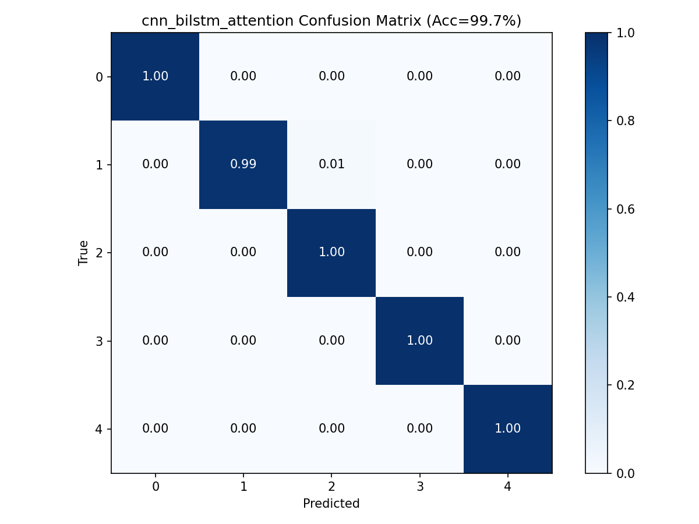

# AI 训练说明与操作指南

## 一、概述

本项目使用深度学习模型（CNN-BiLSTM-Attention）对坐站转换（STS）过程中的5个运动相位进行自动分类识别。本文档介绍如何在本地环境中完成模型训练，包括环境搭建、数据准备、模型训练、结果评估的完整流程。

### 支持的硬件加速
| 平台 | 设备 | 状态 |
|------|------|------|
| Apple Silicon（M1/M2/M3） | MPS GPU | ✅ 已验证 |
| NVIDIA GPU | CUDA | ✅ 支持 |
| CPU | 任意 | ✅ 支持（速度较慢） |

---

## 二、快速开始（5分钟上手）

```bash
# 1. 进入加强版训练目录
cd enhance

# 2. 创建虚拟环境（首次）
python3 -m venv .venv
source .venv/bin/activate

# 3. 安装依赖（首次）
pip install torch scikit-learn scipy matplotlib

# 4. 训练论文原始模型
python train.py --model cnn_bilstm_attention --epochs 100

# 5. 查看结果
ls results/   # 混淆矩阵图 + 训练曲线图
```

---

## 三、环境搭建详解

### 3.1 系统要求
- Python 3.10+
- 8GB+ 内存
- （推荐）支持 MPS 或 CUDA 的 GPU

### 3.2 创建虚拟环境

```bash
cd enhance

# macOS / Linux
python3 -m venv .venv
source .venv/bin/activate

# Windows
python -m venv .venv
.venv\Scripts\activate
```

### 3.3 安装依赖

```bash
pip install torch scikit-learn scipy matplotlib numpy
```

**验证安装**：
```bash
python -c "
import torch
print('PyTorch:', torch.__version__)
print('MPS可用:', torch.backends.mps.is_available() if hasattr(torch.backends, 'mps') else 'N/A')
print('CUDA可用:', torch.cuda.is_available())
"
```

### 3.4 macOS 特别说明

如果遇到 `OMP: Error #15: Initializing libomp.dylib` 错误：
```bash
export KMP_DUPLICATE_LIB_OK=TRUE
```

---

## 四、数据说明

### 4.1 数据集位置
数据集文件 `STS-PD dataset.mat` 位于项目根目录，`enhance/` 下通过符号链接引用。

### 4.2 数据格式
```
STS-PD dataset.mat
└── sts (struct)
    ├── train       → cell array, 每个样本为 [特征维度 × 时间步] 矩阵
    ├── trainlabels → 1D 标签数组
    ├── test        → cell array, 同上
    └── testlabels  → 1D 标签数组
```

### 4.3 数据统计（实际加载后）
| 项目 | 值 |
|------|-----|
| 训练样本 | 15,800 |
| 测试样本 | 6,800 |
| 时间步长 | 128 |
| 特征维度 | 2（垂直加速度 + 垂直角速度） |
| 类别数 | 5 |

### 4.4 标签含义
| 标签 | 相位名称 | 描述 |
|------|----------|------|
| 0 | 初始坐姿 | 坐在椅子上，无运动意图 |
| 1 | 屈曲动量 | 躯干前倾，臀部未离座 |
| 2 | 动量转移 | 臀部离座至膝力矩峰值 |
| 3 | 伸展 | 膝力矩峰值至完全直立 |
| 4 | 稳定站立 | 保持站立，身体稳定 |

---

## 五、模型训练

### 5.1 可用模型

| 模型名称 | 参数量 | 说明 |
|----------|--------|------|
| `cnn_bilstm_attention` | 2.77M | 📄 论文原始模型 |
| `cnn_bilstm_multihead` | 4.11M | 🚀 加强版：多头注意力 |
| `cnn_bilstm_transformer` | 7.07M | 🚀 加强版：LSTM+Transformer混合 |
| `resnet1d_bilstm_attention` | 4.09M | 🚀 加强版：残差CNN |

### 5.2 训练单个模型

```bash
cd enhance
source .venv/bin/activate

# 训练论文原始模型（推荐首先运行）
python train.py --model cnn_bilstm_attention --epochs 100

# 训练加强版：多头注意力
python train.py --model cnn_bilstm_multihead --epochs 100

# 训练加强版：LSTM+Transformer
python train.py --model cnn_bilstm_transformer --epochs 100

# 训练加强版：残差CNN
python train.py --model resnet1d_bilstm_attention --epochs 100
```

### 5.3 训练所有模型并对比

```bash
# 训练所有深度学习模型
python train.py --all

# 训练所有深度学习模型 + 传统机器学习基线
python train.py --all --ml
```

### 5.4 自定义超参数

```bash
python train.py \
    --model cnn_bilstm_attention \
    --epochs 200 \
    --batch_size 32 \
    --lr 0.0005 \
    --hidden_dim 128 \
    --num_layers 3 \
    --dropout 0.3 \
    --seed 42
```

**完整参数列表**：

| 参数 | 默认值 | 说明 |
|------|--------|------|
| `--data` | `STS-PD dataset.mat` | 数据集路径 |
| `--model` | `cnn_bilstm_attention` | 模型名称 |
| `--all` | False | 训练所有模型 |
| `--ml` | False | 同时运行传统ML基线 |
| `--epochs` | 100 | 训练轮数 |
| `--batch_size` | 64 | 批大小 |
| `--lr` | 0.001 | 学习率 |
| `--hidden_dim` | 256 | LSTM/CNN隐藏层维度 |
| `--num_layers` | 2 | LSTM层数 |
| `--dropout` | 0.5 | Dropout率 |
| `--seed` | 42 | 随机种子（保证可复现） |

---

## 六、训练过程解读

### 6.1 训练输出示例

```
🍎 使用 Apple MPS GPU 加速
📦 加载数据: STS-PD dataset.mat
  训练集: 15800 样本
  测试集: 6800 样本
  时间步: 128, 特征维度: 2, 类别数: 5

============================================================
🚀 训练模型: cnn_bilstm_attention
============================================================
  总参数量: 2,766,342
  可训练参数: 2,766,342
  Epoch   1/100 | Train Loss: 0.0835 Acc: 97.4% | Test Acc: 99.6% | Best: 99.6%
  Epoch  10/100 | Train Loss: 0.0085 Acc: 99.8% | Test Acc: 99.0% | Best: 99.6%
  ...
  Epoch 100/100 | Train Loss: 0.0001 Acc: 100.0% | Test Acc: 99.5% | Best: 99.7%
  ⏱️  训练耗时: 515.2s (8.6min)

📊 最终结果 [cnn_bilstm_attention]:
  Accuracy: 99.71%
  F1-Score: 99.71%
```

### 6.2 关键指标说明

| 指标 | 含义 | 期望值 |
|------|------|--------|
| Train Loss | 训练集损失函数值 | 逐渐下降至接近0 |
| Train Acc | 训练集准确率 | 逐渐上升至~100% |
| Test Acc | 测试集准确率 | 论文目标≥99.5% |
| F1-Score | 加权F1分数 | 综合评估各类分类质量 |
| Best | 历史最佳测试准确率 | 最终报告此值 |

### 6.3 判断训练是否正常

✅ **正常情况**：
- Train Loss 持续下降
- Train Acc 持续上升至~100%
- Test Acc 在95%以上波动，最终稳定在99%+

⚠️ **过拟合信号**：
- Train Acc=100% 但 Test Acc 远低于99%
- → 尝试增大 dropout（0.5→0.7）或减小模型（hidden_dim=128）

❌ **训练失败信号**：
- Loss 不下降或震荡剧烈
- → 降低学习率（0.001→0.0001）或检查数据是否正确加载

---

## 七、结果文件说明

训练完成后，会自动生成以下文件：

### 7.1 模型文件
```
enhance/checkpoints/
└── {model_name}_best.pth    # 测试集上最佳epoch的模型权重
```

### 7.2 可视化结果
```
enhance/results/
├── {model_name}_confusion.png   # 混淆矩阵热力图
└── {model_name}_curves.png      # 训练Loss和测试Acc曲线
```

### 7.3 训练日志
```
enhance/train_output.log         # 完整训练日志（后台运行时）
```

### 7.4 如何加载已训练的模型

```python
import torch
from models import get_model

# 加载模型
model = get_model('cnn_bilstm_attention', input_dim=2, num_classes=5)
model.load_state_dict(torch.load('checkpoints/cnn_bilstm_attention_best.pth', weights_only=True))
model.eval()

# 推理
x = torch.randn(1, 128, 2)  # (batch=1, 时间步=128, 特征=2)
with torch.no_grad():
    output = model(x)
    prediction = output.argmax(dim=1).item()
    print(f"预测相位: {prediction}")
```

---

## 八、后台训练

对于长时间训练，推荐使用后台运行：

```bash
cd enhance
source .venv/bin/activate

# 后台运行，输出重定向到日志
nohup python train.py --all --ml --epochs 200 > train_output.log 2>&1 &

# 查看实时进度
tail -f train_output.log

# 检查是否还在运行
ps aux | grep train.py | grep -v grep
```

---

## 九、传统机器学习基线

使用 `--ml` 参数时，会自动运行以下6种传统ML算法作为对比基线：

| 算法 | sklearn类 | 论文参考准确率 |
|------|-----------|---------------|
| KNN (1NN) | KNeighborsClassifier(n_neighbors=1) | ~99.3% |
| SVM | SVC(kernel='rbf') | ~95.8% |
| 决策树 | DecisionTreeClassifier | ~98.1% |
| 随机森林 | RandomForestClassifier(n=100) | ~99.0% |
| 朴素贝叶斯 | GaussianNB | ~73.4% |
| 逻辑回归 | LogisticRegression | ~60.2% |

传统ML方法将变长时间序列零填充后展平为一维向量输入分类器。

---

## 十、常见问题

### Q1：MPS不可用怎么办？
训练脚本会自动降级到CPU。如果想强制使用CPU：
```python
# 在 train.py 中修改 get_device() 函数，或直接设置环境变量
export PYTORCH_ENABLE_MPS_FALLBACK=1
```

### Q2：内存不足（OOM）？
```bash
# 减小batch_size
python train.py --batch_size 16

# 减小模型大小
python train.py --hidden_dim 128
```

### Q3：如何复现论文精确结果？
```bash
# 使用论文中的随机种子和超参数
python train.py --model cnn_bilstm_attention --seed 30 --epochs 100 --batch_size 64 --lr 0.001 --hidden_dim 256 --dropout 0.5
```

### Q4：如何添加自己的模型？
1. 在 `models.py` 中定义新模型类
2. 确保 `forward(self, x)` 接受形状为 `(batch, seq_len, features)` 的输入
3. 将模型注册到 `MODEL_REGISTRY` 字典中
4. 使用 `--model your_model_name` 参数训练

```python
# models.py 中添加
class MyModel(nn.Module):
    def __init__(self, input_dim=6, hidden_dim=256, num_layers=2, num_classes=5, dropout=0.5):
        super().__init__()
        # ... 你的模型结构

    def forward(self, x):
        # x: (batch, seq_len, features)
        # ... 返回 (batch, num_classes) 的logits

MODEL_REGISTRY['my_model'] = MyModel
```

### Q5：如何使用自己的数据？
数据需保存为与 `STS-PD dataset.mat` 相同的格式：
```matlab
sts.train = cell array of [features × time_steps] matrices
sts.trainlabels = 1D integer array (1-based)
sts.test = same format
sts.testlabels = same format
```
然后指定数据路径：
```bash
python train.py --data /path/to/your/dataset.mat
```

---

## 十一、我们的训练结果

使用 Apple M2 MPS GPU，论文原始模型 CNN-BiLSTM-Attention 在 STS-PD 数据集上的复现结果：

| 指标 | 论文报告 | 我们的复现 |
|------|----------|-----------|
| 准确率 | 99.5% | **99.71%** ✅ |
| F1-Score | 99.5% | **99.71%** ✅ |
| 训练时间 | - | 8.6分钟 |
| GPU | RTX 3090 | Apple M2 MPS |



